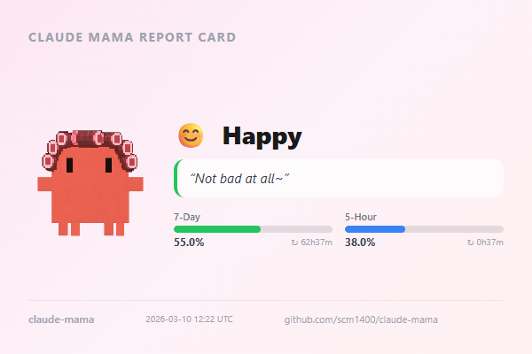

<div align="center">

# 👩‍👦 Claude Mama

**Your API quota is rotting. Mom is disappointed.**

A desktop mascot that guilt-trips you into using your Claude Code tokens — just like a real Korean mom.

[](https://github.com/scm1400/claude-mama/actions/workflows/build.yml)
[](https://opensource.org/licenses/ISC)
[](https://www.electronjs.org/)
[](http://makeapullrequest.com)

<br/>


<br/>

| Angry | Worried | Happy | Proud |
|:---:|:---:|:---:|:---:|
| 😡 "You haven't used any today?!" | 😟 "Everyone else is using theirs..." | 😊 "That's my kid!" | 🥹 "Mom's buying chicken tonight~" |
| < 15% usage | 15–50% usage | 50–85% usage | 85%+ usage |

</div>

---

## What is this?

Claude Mama is a tiny desktop widget that monitors your [Claude Code](https://docs.anthropic.com/en/docs/claude-code/overview) API usage and reacts with the emotional range of a Korean mother who just found out you skipped dinner.

- **Using too little?** She's angry. She didn't raise you to waste a perfectly good API quota.
- **Using a moderate amount?** She's worried. The neighbors' kids are using more.
- **Using a healthy amount?** She's happy. Finally, some return on investment.
- **Maxing it out?** She's proud. Tears are streaming. Chicken is being ordered.

> *"Other moms worry their kids use too much computer. Claude Mama worries you don't use enough."*

## Features

- **Real-time usage tracking** — Pulls 7-day and 5-hour utilization from the Anthropic OAuth API
- **Pixel art character** — A pixel-art mama with curler hair and 6 mood expressions (angry, worried, happy, proud, confused, sleeping)
- **Guilt-powered messages** — Randomized mom-style messages that rotate every 2 minutes
- **5-hour burnout warning** — "Take a break~ You're almost at the limit!" (she cares, in her own way)
- **Share Report Card** — Save a shareable PNG card with your current mood, usage stats, and reset countdown
- **Quote Collection (도감)** — Collect 86 unique mama quotes across 4 rarity tiers (Common, Rare, Legendary, Secret)
- **System tray** — Lives quietly in your taskbar, judging you silently
- **Settings panel** — Position, auto-start, language selection, and collection viewer
- **4 languages** — 한국어, English, 日本語, 中文
- **Auto-start** — Boots with your OS so you can never escape mom's watchful eye
- **Auto-update** — Mom keeps herself up to date via GitHub Releases

### Share Report Card

Save your current mama status as a PNG image — perfect for sharing on social media.

<div align="center">

</div>

The card includes mood, quote, 7-day/5-hour usage bars with reset countdowns, and a UTC timestamp.

### Quote Collection

Mama has 86 unique quotes spread across 4 rarity tiers:

| Rarity | Count | How to Unlock |
|--------|------:|---------------|
| ⚪ Common | 73 | Displayed during normal use |
| 🔵 Rare | 5 | Hit specific usage milestones (0%, 50%, 100% of 5hr, etc.) |
| 🟡 Legendary | 3 | Achieve streaks and lifetime milestones |
| 🔴 Secret | 5 | Use the app on holidays or at 3 AM |

## Installation

### Download

Grab the latest installer from [Releases](https://github.com/scm1400/claude-mama/releases):

| Platform | File |
|----------|------|
| Windows | `Claude Mama Setup x.x.x.exe` |
| macOS | `Claude Mama-x.x.x.dmg` |

### Prerequisites

- [Claude Code](https://docs.anthropic.com/en/docs/claude-code/overview) must be installed and logged in
- That's it. Mom doesn't ask for much.

## How It Works

```
┌─────────────────┐     ┌──────────────┐     ┌─────────────┐
│ Anthropic OAuth │────>│ Usage Tracker │───>│ Mood Engine │
│ Usage API       │     │ (5min poll)   │    │             │
└─────────────────┘     └──────────────┘     └──────┬──────┘
                                                    │
        ┌───────────────────────────────────────────┘
        │
        v
┌──────────────┐     ┌──────────────┐     ┌──────────────┐
│ Pixel Art    │     │ Speech       │     │ Usage Bar    │
│ Character    │     │ Bubble       │     │ Indicator    │
└──────────────┘     └──────────────┘     └──────────────┘
```

1. **Polls** the Anthropic usage API every 5 minutes (falls back to local `stats-cache.json`)
2. **Computes mood** based on weekly utilization thresholds
3. **Renders** a pixel-art mama character with mood-appropriate expression and message
4. **Nags you** until you use your tokens like a responsible adult

### Mood Thresholds

| Weekly Usage | Mood | Mom Says |
|:---:|:---:|---|
| 0–14% | 😡 Angry | "Your quota is rotting away!" |
| 15–49% | 😟 Worried | "Mom is worried about you..." |
| 50–84% | 😊 Happy | "Now that's what I like~" |
| 85–100% | 🥹 Proud | "Perfect! I'm tearing up..." |
| 5hr > 90% | ⚠️ Warning | "Take a break~ 5-hour limit almost reached!" |
| API error | 😵 Confused | "Something went wrong..." |
| No login | 😴 Sleeping | "Log in first!" |

## Development

```bash
# Install dependencies
npm install

# Run in development mode
npm run dev

# Run tests
npm test

# Build for production
npm run build

# Build Windows installer
npm run build:win

# Build macOS installer (requires macOS)
npm run build:mac
```

### Project Structure

```
src/
├── core/                  # No Electron dependencies
│   ├── mood-engine.ts     # Pure function: usage data → mood state
│   ├── messages.ts        # Localized mama message pools
│   ├── usage-tracker.ts   # API polling + cache fallback
│   ├── quote-registry.ts  # Central registry of all 86 collectible quotes
│   ├── quote-triggers.ts  # Trigger conditions for rare/legendary/secret quotes
│   └── quote-collection.ts # Collection manager (unlock tracking)
├── main/                  # Electron main process
│   ├── main.ts            # App entry, window creation
│   ├── ipc-handlers.ts    # Settings IPC + position management
│   ├── settings-window.ts # Settings window factory
│   ├── share-card.ts      # Offscreen PNG card generation
│   ├── tray.ts            # System tray setup
│   ├── auto-launch.ts     # OS auto-start registration
│   └── auto-updater.ts    # GitHub Releases auto-update
├── renderer/              # React UI
│   ├── components/        # Character, SpeechBubble, UsageIndicator
│   ├── pages/
│   │   ├── Settings.tsx   # Settings panel with tab navigation
│   │   └── Collection.tsx # Quote collection (dogam) viewer
│   └── hooks/             # useMamaState hook
└── shared/                # Shared types & i18n
    ├── types.ts
    └── i18n.ts
```

## FAQ

**Q: Can I hide from Claude Mama?**
A: No. She auto-starts with your OS. You can disable it in settings, but she'll know.

**Q: Why does she speak Korean by default?**
A: Because Korean moms are the gold standard of guilt-tripping. You can switch to English, Japanese, or Chinese in settings if your guilt receptors are calibrated differently.

**Q: My usage is at 0% but I've been coding all day?**
A: Make sure Claude Code is logged in. Mom can't monitor what she can't see.

**Q: How do I unlock secret quotes?**
A: Use the app on holidays (New Year, Chuseok, Christmas) or stay up coding past 3 AM. Mom notices everything.

**Q: Is this a joke?**
A: The guilt is real. The chicken reward is not (yet).

**Q: Will there be a Claude Dad version?**
A: Claude Dad went out for tokens and never came back.

## Contributing

PRs welcome! Whether it's new languages, more guilt-inducing messages, or pixel art improvements — mom appreciates the help.

1. Fork this repo
2. Create your feature branch (`git checkout -b feature/more-guilt`)
3. Commit your changes
4. Push to the branch
5. Open a Pull Request

## License

[ISC](LICENSE) — Free as in "mom's love" (unconditional, but with expectations).

---

<div align="center">

**Built with guilt and ❤️**

*If this made you mass-consume your Claude API quota, please star the repo. Mom would be proud.*

</div>
